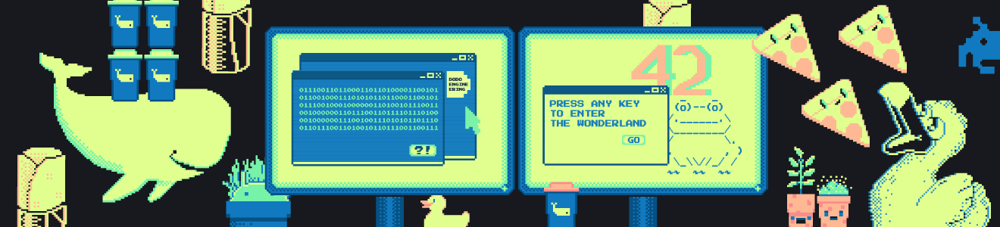

# Где я?

Ты в **RTFM**. Это мануал команды Dodo Engineering. Он предназначен для использования нашими разработчиками, а также всеми людьми/инопланетянами/роботами, которым интересна наша жизнь. Здесь мы открыто рассказываем про то, как создаём и развиваем IT в Dodo Brands (Додо Пицца, Дринкит, Донер42). Здесь ты узнаешь про ценности, принципы, бизнес-процессы, инструменты и правила жизни нашей команды.

> Мы приветствуем принцип **no bullshit**, поэтому если увидишь здесь информацию, которая покажется странной, неправильной и ты знаешь как лучше — смело присылай pull requests или пиши в личку @Schvepsss в любых соц. сетях (ну или почти любых).

# Коротко о команде Dodo Engineering

Наша команда появилась 22 апреля 2011 года в Сыктывкаре вместе с появлением первой пиццерии Додо Пиццы. Тогда она состояла из двух разработчиков, которые создали сайт для заказа пиццы и заложили основу Dodo IS (наша самописная система). За это время мы сильно выросли. Сейчас система объединяет в себе функционал ERP+CRM+HRM и помогает франчайзи открывать бизнес «из коробки».

В 2017 году нас было 20, сейчас 120+. 2019 год стал переломным. Команда выросла больше чем в 3 раза, процессы поплыли, структура перестала работать эффективно. В конце года мы начали перестройку. За полгода прошли путь от хаоса и разрухи до понятной структуры на 120+ человек и 18 команд. Мы будем дальше масштабироваться, и теперь понимаем, как будет работать команда на 200, на 300 человек. Понимаем, какие задачи будут перед нами стоять, какую роль во всём этом играет распил монолита, куда можно расти разработчикам.

В 2020 году наш бизнес вырос. Теперь мы Dodo Brands – помимо Додо Пиццы, работаем над развитием кофеен Дринкит и донерных Донер42. Планируем открытие нескольких новых стран. Продолжаем расти и масштабироваться вместе с бизнесом, решая проблему с помощью написания строчки кода и раскатки решения на все точки питания.

# Коротко в цифрах

| Мы | Цифры и знаки|
|:------------- |:---------------:|
| Всего сотрудников в компании | 400+ |
|IT-команда | 150+ |
|Количество пиццерий | 600+ |
|Количество стран | 14 |
|Количество клиентов | 12 000 000+ |
|Максимальная нагрузка (заказов в минуту) | 365 |
|Стандартная нагрузка (заказов в минуту) | 150 |
|RPS | 2800 |
|Выручка в 2020 году (рублей) | 26 000 000 000 |

# Коротко о технологиях

* .NET Framework, переходим постепенно на .NET Core:
  * ASP.NET MVC в монолите – 14 сервисов;
  * ASP.NET Core в монолите – 2 сервиса;
  * ASP.NET Core вне монолита на win серверах – 4 сервиса;
  * ASP.NET Core вне монолита в k8s – 24 сервиса.
* на сайте React + TypeScript, в бекофисе мигрируем с jQuery, Angular первых версий тоже на React + TypeScript;
* 36 баз MySql на кластерах, кроме dev окружений;
* всё на Azure, с использованием RabbitMQ (местами Kafka, Azure Event Hubs), Kusto, CosmosDB, Redis и ещё много мелких радостей;
* все новые сервисы мы пишем на .Net, под Linux, запускаем в Kubernetes;
* детальный мониторинг на продакшене на базе Prometheus, сбор логов в Kusto, визуализация в Grafana, пейджер для дежурного в PagerDuty.

# 7 технологических радаров Dodo Engineering

1. [Infrastructure](https://radar.thoughtworks.com/?sheetId=https%3A%2F%2Fdocs.google.com%2Fspreadsheets%2Fd%2Fe%2F2PACX-1vTkAM6j2AWXacXHXJTUsIXPDNaO3_TSGHf4hznVlAsxX-vqpBLh3IktlfdkfWg773MukCciR2b3qbeG%2Fpub%3Fgid%3D1595809259%26single%3Dtrue%26output%3Dcsv).
2. [Backend](https://radar.thoughtworks.com/?sheetId=https%3A%2F%2Fdocs.google.com%2Fspreadsheets%2Fd%2Fe%2F2PACX-1vR_ganQRbiNyK5yTlbM_NtdiTFDxBAuWqM-IXIdhpw-J54HVK3afvYQdxmPCOVbnDaHpT8819hHSoC9%2Fpub%3Fgid%3D0%26single%3Dtrue%26output%3Dcsv).
3. [Frontend](https://radar.thoughtworks.com/?sheetId=https%3A%2F%2Fdocs.google.com%2Fspreadsheets%2Fd%2Fe%2F2PACX-1vTXZPdjmJpGKkiYVdVbIqTckcwZL_Wt6fCE8nK5-EPMERJSaerlMW3aEM0PuRxwhg-Js6Fa1wOAEU3S%2Fpub%3Fgid%3D604704275%26single%3Dtrue%26output%3Dcsv).
4. [QA](https://radar.thoughtworks.com/?sheetId=https%3A%2F%2Fdocs.google.com%2Fspreadsheets%2Fd%2Fe%2F2PACX-1vTg7AiVyTvKoyLV6bYG0hdhgXyWt_cDFbSD91oyQqYF5eTAoQf_Gm347TW-jKHxW6vmK58Rlq0dqGXg%2Fpub%3Fgid%3D1077860502%26single%3Dtrue%26output%3Dcsv).
5. [Data](https://radar.thoughtworks.com/?sheetId=https%3A%2F%2Fdocs.google.com%2Fspreadsheets%2Fd%2Fe%2F2PACX-1vSm1jr1lCAIhic4_FN0ghI2e536MrOq_vIQK6Spi7P-EMCLxRpWXA8QOpTbi-0_DgrQSWLIY63kHnKN%2Fpub%3Fgid%3D0%26single%3Dtrue%26output%3Dcsv).
6. [iOS](https://radar.thoughtworks.com/?sheetId=https%3A%2F%2Fdocs.google.com%2Fspreadsheets%2Fd%2Fe%2F2PACX-1vSRJehdNmXfaAjvOeFqf_rgB_ePpdIXtglUp0Wt_iH6VGuE8AJsBsMXenDenn7P1hpkTuDNnBpPqy0R%2Fpub%3Fgid%3D892813566%26single%3Dtrue%26output%3Dcsv).
7. [Android](https://radar.thoughtworks.com/?sheetId=https%3A%2F%2Fdocs.google.com%2Fspreadsheets%2Fd%2Fe%2F2PACX-1vQLlVWsdUqugTQf6NGkbmAMbrQSC6_94119wL6eUYmB9Ag88PrIIZANaJXrGMS5r1HLVrQVwJvi_MsN%2Fpub%3Fgid%3D1775347845%26single%3Dtrue%26output%3Dcsv).

# Что ещё?

* Стратегия и правила жизни на корабле.
  * [Миссия, ценности, принципы](docs/our-mission.md).
  * Стратегия в IT.
* Как мы ведём разработку Dodo IS.
  * [Что такое Dodo IS](https://habr.com/ru/company/dododev/blog/506136/).
  * [Структура команды](docs/team-structure.md).
  * Инженерные практики.
  * Целеполагание и ревью.
  * [Развитие и возможности в IT](docs/self-development.md).
  * [Onboarding](https://habr.com/ru/company/dododev/blog/510382/).
* Как проходят собеседования и как стать частью нашей команды:
  * Как проходят собеседования.
  * [Вакансии](https://dodo.dev/manager#jobs).
* [Где нас можно найти](docs/resource-links.md).
