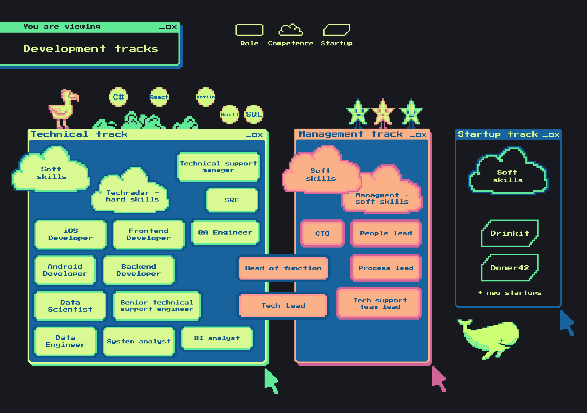

# Развитие и возможности в IT

Каждая компания создаётся людьми. Мы не исключение. Когда растёшь ты, растём и мы. Чтобы каждый из нас понимал, как и куда можно развиваться, мы создали этот документ.

## Карта развития в IT

Каждая компания создаётся людьми. Мы не исключение. Помни, когда растёшь ты, растём и мы. Чтобы каждый из нас понимал, как и куда можно развиваться, мы сделали эту карту.

В ней ты найдёшь 3 ключевых направления, в которых можно развиваться:

1. **Технический трек.** Нужен тем, кто хочет углубить или расширить свои знания в технологиях.
2. **Менеджерский трек.** Нужен тем, кто хочет развиваться как менеджер и готов брать на себя ответственность за команду или целый продукт.
3. **Стартап трек.** Нужен тем, кто жаждет приключений и готов работать в условиях полной неопределённости. Это зона новых вызовов.

Внутри каждого трека есть:

* **роли** — это направления и должности внутри трека (обозначаются прямоугольником);
* **компетенции** — это soft и hard skills, необходимые для развития внутри каждого трека (обозначается облаком).

### Технический трек

Прокачиваясь в техническом треке, ты можешь развиваться «вширь» или «вглубь»: наращивать свою экспертизу внутри одной должности и становиться всё более мощным экспертом в конкретной технологии, или изучить больше и перейти с одной позиции на другую (например, из Backend-разработчика перейти в SRE).

Путь развития в техническом треке:

* **Шаг 1. Пойми, в какой области хочешь развиваться.**\
Инструменты: [структура IT-команды и описание ролей](team-structure.md), [карта развития в IT](./self-development.md), [1-1 с People lead](https://docs.google.com/spreadsheets/d/1kYsn3N0buzfPPuQt9avvvboDmOrikdpFE1z-QqBHVL4/edit#gid=0).

* **Шаг 2. Узнай какие технологии актуальны в компании и в твоей области.**\
Инструменты: [структура компании](https://miro.com/app/board/o9J_kyKdPj0=/), [1-1 с People lead](https://docs.google.com/spreadsheets/d/1kYsn3N0buzfPPuQt9avvvboDmOrikdpFE1z-QqBHVL4/edit#gid=0), [технологические радары](../README.md).

* **Шаг 3. Оцени свой уровень знаний в выбранной технологии.**\
Инструменты: [ИПР](https://docs.google.com/spreadsheets/d/1HQ_Bwpp_iUgUqrTTmSCyX45EgPyGae_i2Cn4emiOUQc/edit#gid=1104685311) (вкладка «самооценка hard skills»).

* **Шаг 4. Если в твоей команде эти технологии не актуальны, посмотри какие вакансии открыты внутри компании.**\
Инструменты: [возможности в IT](https://docs.google.com/spreadsheets/d/1tBXK58n4I7nHSOlFmzSNWb9c8yT8rEp36qCB-2DrFMo/edit#gid=0), [1-1 с People lead](https://docs.google.com/spreadsheets/d/1kYsn3N0buzfPPuQt9avvvboDmOrikdpFE1z-QqBHVL4/edit#gid=0).

* **Шаг 5. Приходи к People lead и составляй план развития.**\
Инструменты: [ИПР](https://docs.google.com/spreadsheets/d/1HQ_Bwpp_iUgUqrTTmSCyX45EgPyGae_i2Cn4emiOUQc/edit#gid=1104685311) (вкладка «индивидуальный план развития»).

Каждый шаг ты можешь пройти вместе со своим People lead.

### Менеджерский трек

Наша компания постоянно растёт. Мы сохраняем плоскую структуру, где каждый может подойти к CEO и CTO, чтобы поделиться своим видением. При этом созрела необходимость в менеджменте продуктов и процессов, иначе компания сложится, как карточный домик, под собственной тяжестью. Если ты хочешь больше работать с людьми, влиять на функцию или развивать направление, этот трек для тебя.

Путь развития в менеджерском треке:

* **Шаг 1. Выбери роль, которая тебе интересна.**\
Инструменты: [структура IT-команды и описание ролей](team-structure.md), [карта развития в IT](./self-development.md).

* **Шаг 2. Оцени свой уровень менеджерских компетенций.**\
Инструменты: [ИПР](https://docs.google.com/spreadsheets/d/1HQ_Bwpp_iUgUqrTTmSCyX45EgPyGae_i2Cn4emiOUQc/edit#gid=1104685311) (вкладка «самооценка soft skills»), [модель компетенций Додо](https://docs.google.com/spreadsheets/d/10LSPDAaCpIHkZmwGzcshTpMWEgCVQgLhVy9xOa_GPVA/edit?usp=sharing).

* **Шаг 3. Если ты выбрал роль People lead, приходи к Даше Мамлыгиной. Если любую другую – к Саше Андронову.**\
Инструменты: [ИПР](https://docs.google.com/spreadsheets/d/1HQ_Bwpp_iUgUqrTTmSCyX45EgPyGae_i2Cn4emiOUQc/edit#gid=1104685311) (вкладка «индивидуальный план развития»).

### Стартап трек

Мы учимся масштабировать свой опыт развития бизнеса и запускаем новые направления. Сейчас это 2 стартапа Дринкит и Донер42. Кто знает, сколько их будет через год? Прокачиваясь в стартап треке, ты попадёшь в условия настоящего стартапа, где нужно будет учиться делать разноплановые задачи, а может быть даже определять путь развития компании. Этот трек подойдёт для тех, кто хочет приключений и новых впечатлений.

Путь развития в стартап треке:

* **Шаг 1. Приходи к Саше Андронову.**

Если у тебя остались вопросы по карте развития, можешь задать их Даше Мамлыгиной.

## Полезные инструменты

1. [Структура компании](https://miro.com/app/board/o9J_kyKdPj0=/).
2. [Структура IT-команды и описание ролей](team-structure.md).
3. [Карта развития в IT](./self-development.md).
4. [Возможности в IT](https://docs.google.com/spreadsheets/d/1tBXK58n4I7nHSOlFmzSNWb9c8yT8rEp36qCB-2DrFMo/edit#gid=0). (доступно только для ребят из Dodo)
5. [Индивидуальный план развития (ИПР)](https://docs.google.com/spreadsheets/d/1HQ_Bwpp_iUgUqrTTmSCyX45EgPyGae_i2Cn4emiOUQc/edit#gid=1104685311). (доступно только для ребят из Dodo)
6. [Технологические радары](../README.md).
7. [1-1 с People lead](https://docs.google.com/spreadsheets/d/1kYsn3N0buzfPPuQt9avvvboDmOrikdpFE1z-QqBHVL4/edit#gid=0). (доступно только для ребят из Dodo)
8. [Модель компетенций Додо](https://docs.google.com/spreadsheets/d/10LSPDAaCpIHkZmwGzcshTpMWEgCVQgLhVy9xOa_GPVA/edit?usp=sharing).
